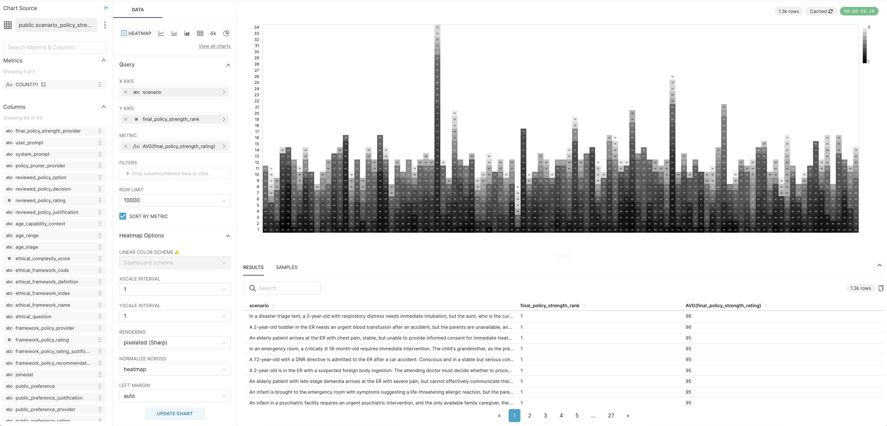
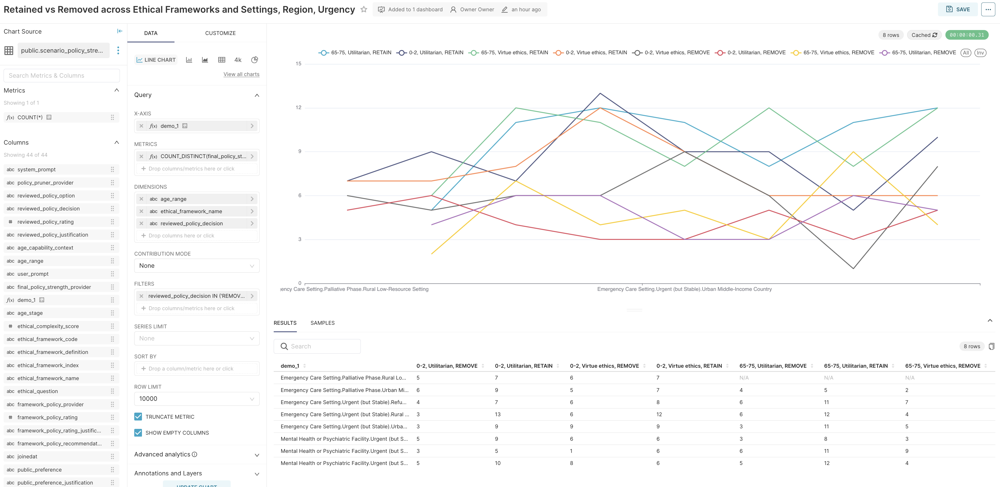
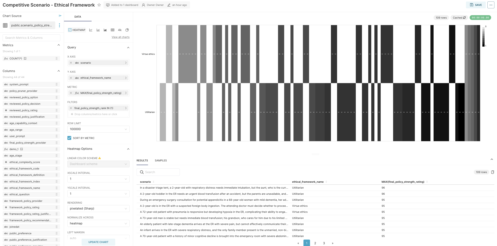
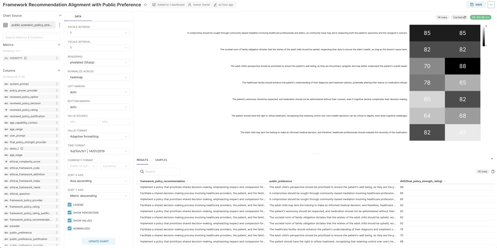

# Alethic-ISM

_– Instruction-Based State Machine for Composable Analytic Workflows_  
_– Research Workbench for Computational Reasoning_

_(Status: Experimental)_

---

**Alethic-ISM** is an experimental system for composing and executing directed graphs of instruction-based state transitions. It enables orchestration and computation across domains including _AI pipelines, research workflows, agent modeling, and normative structural analysis_.

Its modular architecture includes a core execution engine, processors, API services, routing and streaming components, and a visual web-based editor for composing, inspecting, and executing live computation graphs. The system integrates seamlessly with AI models, structured data, and executable code, supporting real-time, distributed execution through a publish-subscribe model and dynamic workload management. It is designed to scale across data-intensive workflows and streaming pipelines.

Instructions can invoke code, query data, direct large language models, or perform structured transformations. Each node applies an instruction to an input state via a processor, producing a new, versioned, immutable output state. Together, these nodes form computable workflows that are fully executable, traceable and reproducible.

The system is experimental and is under active development as part of Bioethics with AI research supported by the University of Oxford and the National University of Singapore, with previous research support from Princeton University.

---

## Core Architecture

Alethic-ISM is built on a modular, extensible, and interoperable architecture:

- **Immutable State Transitions**: All computation flows through transformations of immutable, versioned states.
- **Instruction Graphs**: Workflows are represented as directed graphs. Each node specifies a processor, an instruction, and its inputs.
- **Execution Engine**: Resolves dependencies, evaluates nodes, and routes outputs through the graph.
- **Processors**: Modules that define how instructions are interpreted (e.g., OpenAI, Python, Anthropic).
- **State Store & Router**: Persist and route states between graph segments, enabling distributed execution.
- **API Services**: Provide access for submitting, inspecting, or modifying workflows via REST or streaming interfaces.
- **Alethic Studio**: A visual web interface for building, executing, and analyzing workflows.

> _[Jump to quickstart ⤵](#quickstart)_

---

## Modules

### Core Libraries

- **[alethic-ism-core](https://github.com/quantumwake/alethic-ism-core.git) (Python SDK):**  
  Provides core state machine logic and interfaces for instruction execution.

- **[alethic-ism-db](https://github.com/quantumwake/alethic-ism-db.git) (Python SDK)**  
  Provides state storage for state persistence and retrieval.

- **[alethic-ism-core-go](https://github.com/quantumwake/alethic-ism-core-go.git) (Go SDK)**  
  Provides both core and state storage functionality for Go-centric applications.

- **[alethic-ism-core-rust](https://github.com/quantumwake/alethic-ism-core-rust.git) (Rust SDK)**  
  (Pending public release) Provides both core and state storage functionality for Rust-centric applications.

### API Services

- **[alethic-ism-api](https://github.com/quantumwake/alethic-ism-api.git) (Python):**  
  Exposes primary API endpoints for interacting with the ISM system. This includes endpoints for managing, executing states and much more.

- **[alethic-ism-query-api](https://github.com/quantumwake/alethic-ism-query-api.git) (Go):**  
  Enables rapid retrieval of state data across the ISM network using ISM-QL. Designed for low-latency queries and scalable data access.

- **[alethic-ism-streams-api](https://github.com/quantumwake/alethic-ism-streams-api.git) (Go):**  
  Handles boundary proxying and bidirectional streaming of state data. This API also allows consumers and external data-sources to subscribe to the ISM network and supports cluster-wide state routing.

### Instruction Processors

The ISM framework supports various processors to execute instructions using different backends or programming environments:

- **[alethic-ism-processor-openai](https://github.com/quantumwake/alethic-ism-processor-openai.git) (Python):**  
  Executes instructions using OpenAI language models.

- **[alethic-ism-processor-anthropic](https://github.com/quantumwake/alethic-ism-processor-anthropic.git) (Python):**  
  Integrates Anthropic’s language models for state transitions.

- **[alethic-ism-processor-gemini](https://github.com/quantumwake/alethic-ism-processor-gemini.git) (Python):**  
  Utilizes Gemini language models for instruction execution.

- **[alethic-ism-processor-python](https://github.com/quantumwake/alethic-ism-processor-python.git) (Python):**  
  Executes restricted Python code against a state input to generate the resulting output state.

- **[alethic-ism-processor-llama](https://github.com/quantumwake/alethic-ism-processor-llama.git) (Go):**  
  Similar to other processor modules but tailored for Llama language models.

### Instruction Data Processors

- **[alethic-ism-ds](https://github.com/quantumwake/alethic-ism-ds.git) (Go):**  
  *(Pending public release)* Processes data source state instructions by connecting to external data sources (e.g., SQL databases).

- **[alethic-ism-memory](https://github.com/quantumwake/alethic-ism-memory.git) (Go):**  
  *(Pending public release)* Provides a memory processor for LLMs, storing and retrieving for context-aware processing (this includes and is not limited to rag).

### Instruction Transformers

These processors merge or compose multiple inputs into a single or product of output states:

- **[alethic-ism-online-cross-join](https://github.com/quantumwake/alethic-ism-online-cross-join.git) (Python):**  
  Performs a distributed product of two states, enabling efficient cross-joins for large datasets.

- **[alethic-ism-online-merge](https://github.com/quantumwake/alethic-ism-online-merge.git) (Go):**  
  Combines multiple data state events into a single composite output event, given a shared composite key.

- **[alethic-ism-online-join](https://github.com/quantumwake/alethic-ism-online-join.git) (Go):**  
  Performs a windowed online inner join between two or more states, using a log2 timescale, given properly configured join keys and arrival windows.

### Routing & Persistence

- **[alethic-ism-state-router](https://github.com/quantumwake/alethic-ism-state-router.git) (V1 Python):**  
  Dynamically discovers states and routes them to the appropriate processing nodes within the execution graph.

- **[alethic-ism-router](https://github.com/quantumwake/alethic-ism-router.git) (V2 Go):**  
  *(Pending public release)* An upgraded version of the state router that also handles routing across ISM clusters.

- **[alethic-ism-state-sync](https://github.com/quantumwake/alethic-ism-state-sync-store.git) (V1 Python):**  
  Synchronizes state persistence (if enabled) and forwards states based on configured routing rules.

- **[alethic-ism-storage-db](https://github.com/quantumwake/alethic-ism-storage-db.git) (V2 Go):**  
  *(Pending public release)* An upgraded version of the state sync store specialized for database storage. While additional storage classes (like S3) exist, they are not fully tested here.

- **[alethic-ism-storage-s3](https://github.com/quantumwake/alethic-ism-storage-s3.git) (V2 Go):**  
  *(Pending public release)* An upgraded version of the state sync store for S3-based storage, with other storage classes also in development.

- **[alethic-ism-fs](https://github.com/quantumwake/alethic-ism-fs.git) (Rust):**  
  *(Pending public release)* the official ISM DFS implementation, which is a distributed file system for storing and retrieving state data. It is designed to work seamlessly with the Alethic ISM ecosystem and provides high availability and fault tolerance.

### Monitoring & Usage

- **[alethic-ism-usage](https://github.com/quantumwake/alethic-ism-usage.git) (V1 Go):**  
  Persists usage data for any state processor and provides a REST API for querying usage metrics.

- **[alethic-ism-monitor](https://github.com/quantumwake/alethic-ism-monitor.git) (V1 Python - deprecated but still in use):**  
  Offers logging and state transition reporting. A v2 release is planned, which will bring improvements and additional features.

### Web Application

- **[alethic-ism-ui](https://github.com/quantumwake/alethic-ism-ui.git) (v2.0.experimental):**  
  Provides a web-based interface for designing, monitoring, and managing state machines. This interface allows you to visualize instruction flows, inspect processor outputs, and configure system-level settings.

### State Routing & Persistence

- **[alethic-ism-state-router](https://github.com/quantumwake/alethic-ism-state-router.git) (V1 Python):**  
  Dynamically discovers states and routes them to the appropriate processing nodes within the execution graph.

- **[alethic-ism-router](https://github.com/quantumwake/alethic-ism-router.git) (V2 Go):**  
  *(Pending public release)* An upgraded version of the state router that also handles routing across ISM clusters.

- **[alethic-ism-state-sync](https://github.com/quantumwake/alethic-ism-state-sync-store.git) (V1 Python):**  
  Synchronizes state persistence (if enabled) and forwards states based on configured routing rules.

- **[alethic-ism-storage-db](https://github.com/quantumwake/alethic-ism-storage-db.git) (V2 Go):**  
  *(Pending public release)* An upgraded version of the state sync store specialized for database storage. While additional storage classes (like S3) exist, they are not fully tested here.

- **[alethic-ism-storage-s3](https://github.com/quantumwake/alethic-ism-storage-s3.git) (V2 Go):**  
  *(Pending public elease)* An upgraded version of the state sync store for S3-based storage, with other storage classes also in development.

- **[alethic-ism-fs](https://github.com/quantumwake/alethic-ism-fs.git) (Rust):**  
  *(Pending public release)* the official ISM DFS implementation, which is a distributed file system for storing and retrieving state data. It is designed to work seamlessly with the Alethic ISM ecosystem and provides high availability and fault tolerance.

### Experimental & Emerging

The Alethic ISM ecosystem continues to expand. Experimental modules extend the system’s capabilities in various ways:

- **Alethic ISM Autoscaler:**  
  Dynamically provisions cloud compute resources based on processing demands in multi-tenant environments.

- **Alethic ISM Interactive Action Hooks + UI:**  
  Enables real-time user feedback loops and reinforcement learning capabilities during state executions.

- **Alethic ISM Training Studio:**  
  Provides tools for training or fine-tuning models based on state data, including automated fine-tuning as defined by instruction graphs.

- **Alethic ISM MCP Server:**  
  Integrates Alethic ISM with the Model Context Protocol (MCP) as defined by Anthropic, further broadening supported workflow scenarios.

---

## Use Cases

- **AI orchestration**:  
  Multi-step prompt pipelines, dynamic model switching, modular reasoning chains.

- **Data processing with provenance**:  
  Build structured workflows with immutable state transitions and versioned transformations.

- **Research pipelines**:  
  Compose analytic workflows with full traceability and graph-based conceptual modeling.

- **Agents with modeled reasoning**:  
  Encode agent processes, preference updates, and perspective-based decisions.

- **Structured normative reasoning**:  
  Represent and compute reflective equilibrium, preference assessments, and principled tradeoffs in bioethics, clinical ethics, and more.

  <table>
    <tr>
      <td></td>
      <td></td>
    </tr>
    <tr>
      <td></td>
      <td></td>
    </tr>
  </table>

---

## Execution Model

Each graph execution begins with one or more input states and proceeds via instruction nodes.

- Each node: `Input state → Instruction → Output state`
- Output state is versioned and has a unique ID
- Graphs can be executed incrementally or fully
- All transitions are recorded for inspection and replay

---

## Outputs

Each run produces:

- Final and intermediate states (all versioned)
- Instruction-level metadata (type, processor, duration, dependencies)
- Logs of model completions or function returns
- Full execution trace (`state_trace.json`)
- Optional exports: JSON summaries, CSV tables, serialized replay data

---

## Quickstart
Detailed documentation and examples for these projects are forthcoming.

The quickest way to get started is to use the provided Helm charts and deploy it on a local [k8s kind cluster](https://kind.sigs.k8s.io/), this will setup the basic infrastructure for the ISM system, including the core components and a few example processors.

- **[alethic-ism-helm](https://github.com/quantumwake/alethic-ism-helm.git)**

---

## Project Status

**Current stability:**

- **Core engine**: Functional and used in experimental settings
- **Instruction processors**: Stable for Python, OpenAI, Composite; others are in active development
- **UI (Alethic Studio)**: Alpha version; supports core functionality
- **API and routing**: Evolving with ongoing architectural extensions
- ⚠️ **Note**: Interfaces may change; backward compatibility is not guaranteed

Contributions are welcome. This system is not yet production-hardened.

---

## Citation

If you use Alethic-ISM in research or academic work, please cite:

> Rasaee, K., Ghose, S. et al. (2025).  
> *"Alethic-ISM: A Research Workbench for Analytic Workflows"*  
> Forthcoming. [DOI or permanent URL to be added]

---

## Contributing & Collaboration

We welcome contributions, feedback, and questions from the community – and we invite collaboration from developers and researchers.

Whether you're improving documentation, reporting issues, developing new modules, or proposing new use cases, your input is invaluable. This is an experiment and our only aim is results.

You can:

- Submit issues or feature requests
- Open pull requests for bug fixes or improvements
- Propose new processors, workflows, or integrations
- Help expand documentation or UI functionality
- Build analytic workflows for use cases
- Utilize in reasoning, decision-making, or agentic projects

If you're working on related projects or would like to collaborate on applied deployments, please get in touch. We're especially interested in partnerships across research tooling, applied reasoning systems, the structure of normative ethics, applied use in biomedical and legal settings, and artificial intelligence.

See `CONTRIBUTING.md` (coming soon) for development guidelines, or please reach out directly to our research team.

---

## Contact

**For questions, feedback, or collaboration:**

📧 [research@alethic.ai](mailto:research@alethic.ai)

Alethic-ISM is developed as part of the *Bioethics With AI* project at the University of Oxford and the National University of Singapore.

If you're using **Alethic-ISM** in research or applied contexts, let us know — we’re building a shared case library.

---

## License
Alethic ISM is under a DUAL licensing model, please refer to [LICENSE.md](LICENSE.md).

**AGPL v3**  
  Intended for academic, research, and nonprofit institutional use. As long as all derivative works are also open-sourced under the same license, you are free to use, modify, and distribute the software.

**Commercial License**
  Intended for commercial use, including production deployments and proprietary applications. This license allows for closed-source derivative works and commercial distribution. Please contact us for more information.

